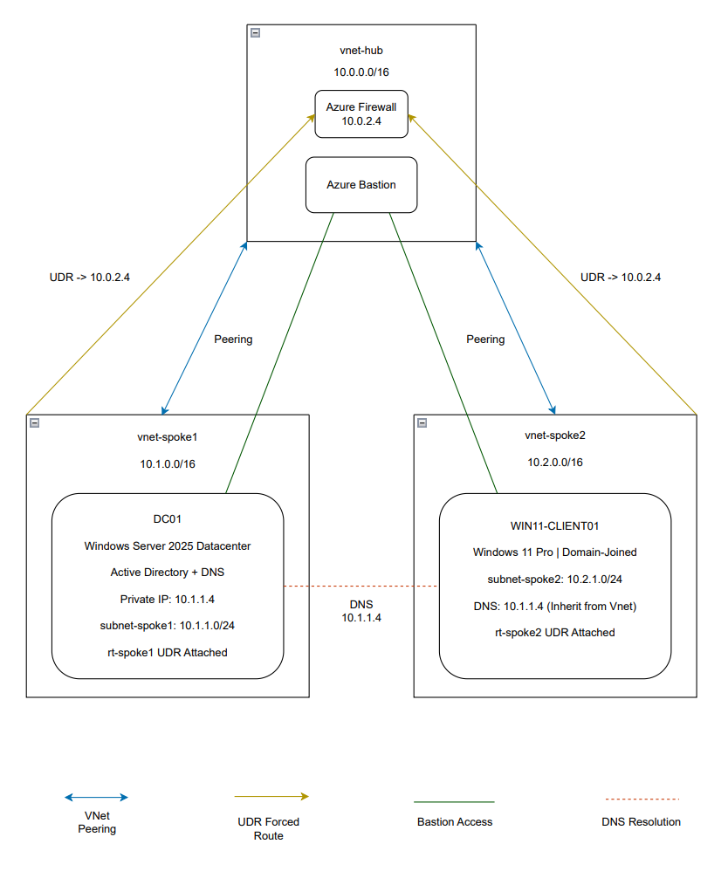

# Network Diagram

**Overview**

This diagram illustrates the hub-and-spoke network topology deployed in Microsoft Azure. It details the relationship between the three VNets, the centralized security components housed in the hub, and the products running in and for each spoke.

**Architecture Summary** 

The hub VNet (10.0.0.0/16) acts as the central transit point for all network traffic. Both spoke VNets peer directly to the hub but cannot communicate with each other without traffic first passing through the Azure Firewall at 10.0.2.4. This is enforced via User Defined Routes attached to each spoke subnet, which set the firewall as the next hop for all inter-spoke traffic. Azure Bastion is deployed in the hub and provides secure RDP and SSH access to virtual machines in both spokes without requiring public IP addresses on any workload.

  

