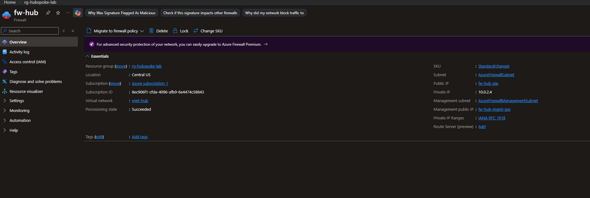
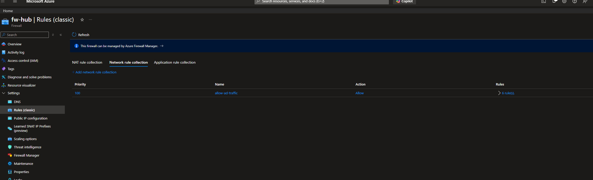
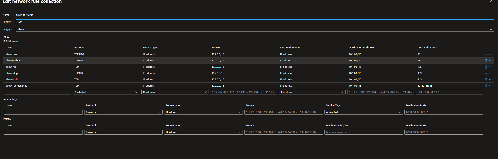
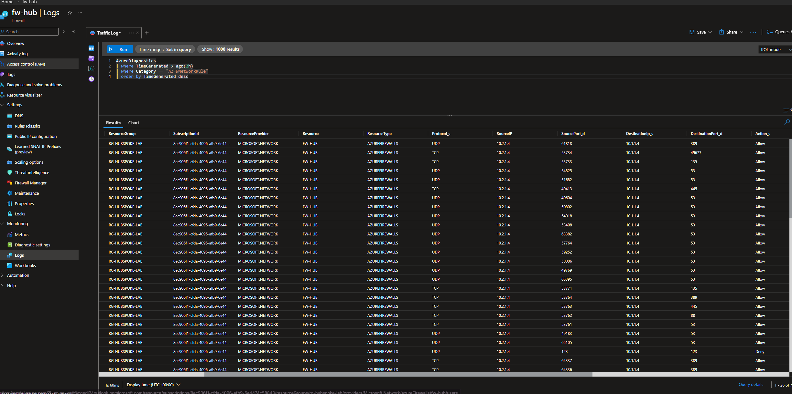

# Firewall

**Overview**

Azure Firewall is deployed in the hub VNet as the central security enforcement point for all inter-spoke traffic. It operates as a managed, cloud-based network security service that monitors and controls traffic flowing between vnet-spoke1 and vnet-spoke2.

**How It Works**

Azure Firewall sits in its own dedicated subnet (AzureFirewallSubnet 10.0.2.0/26) inside the hub VNet. When a packet leaves WIN11-CLIENT01 destined for DC01, the User Defined Route on subnet-spoke2 intercepts it and forwards it to the firewall's private IP (10.0.2.4) instead of routing it directly. The firewall then evaluates the packet against its rule collections. If a matching allow rule exists, the traffic is forwarded, if not, it is dropped by default. This default-deny behavior means no inter-spoke communication is permitted unless explicitly allowed. 

**Firewall Overview**

This photo shows the overview of the Azure Firewall. On the right hand side, you will see the SKU, the subnet the firewall lives in, the management subnet, and public and private IP addresses. 

**Firewall Rule Collection**

A single network rule collection named "allow-ad-traffic" was created to permit the ports required for Active Directory communication between the spokes.

**Why these ports?**

Active Directory domain join requires more than just basic connectivity. Each port serves a specific purpose in the authentication and communication process: 

Port 53 - DNS | Required for domain name resolution

Port 88 - Kerberos | The authentication protocol used by Active Directory

Port 135 - RPC Endpoint Mapper | Directs clients to the correct service port

Port 389 - LDAP | Used to query Active Directory for domain information

Port 445 - SMB | Used for file sharing and group policy

49152-65535 - Dynamic RPC Ports | The RPC Endpoint Mapper on port 135 redirects clients to a randomly assigned high port for the actual session. Without this range open, domain join silently fails even when all other ports are allowed.

**Monitoring**

A Log Analytics workspace (workspace-hub) was configured to capture firewall network rule logs. Traffic flowing between the spokes can be confirmed using the methods shown in the photos below: 

**Next Hop**

**Firewall Logs**

For deeper traffic analysis, the following query was ran to confirm traffic between the firewall and the spokes: 

