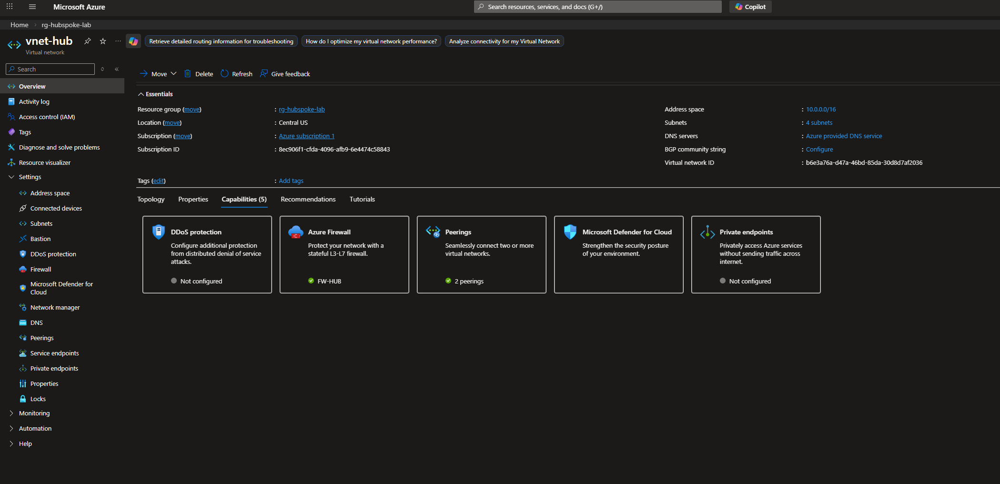
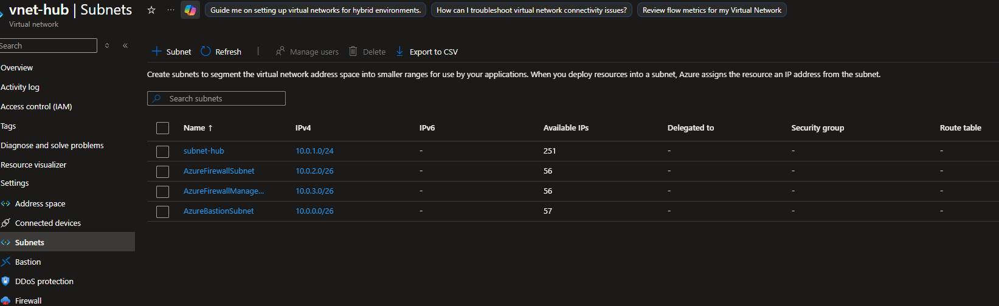
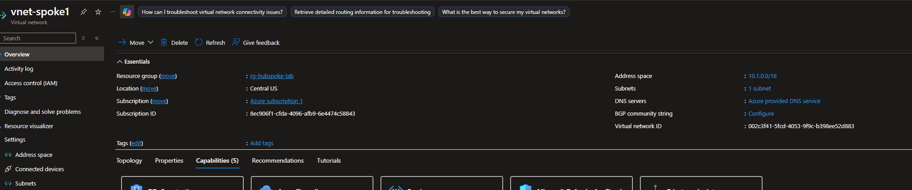
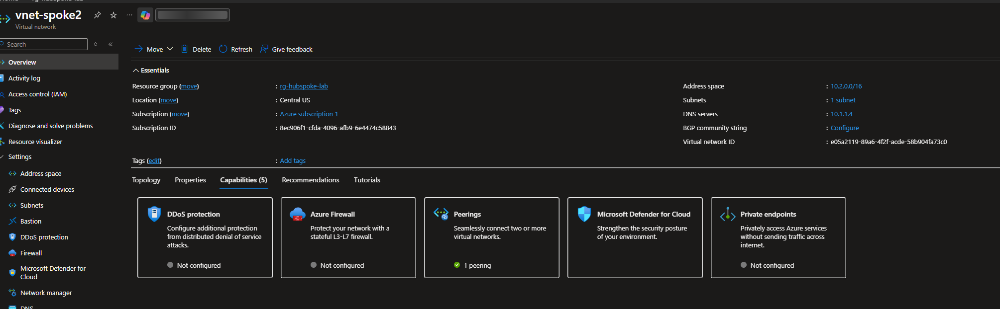
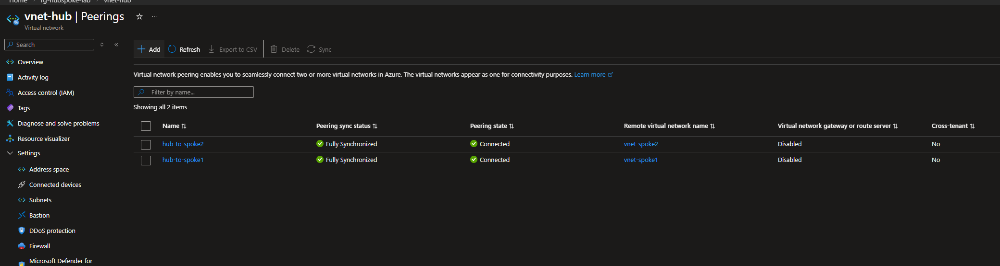
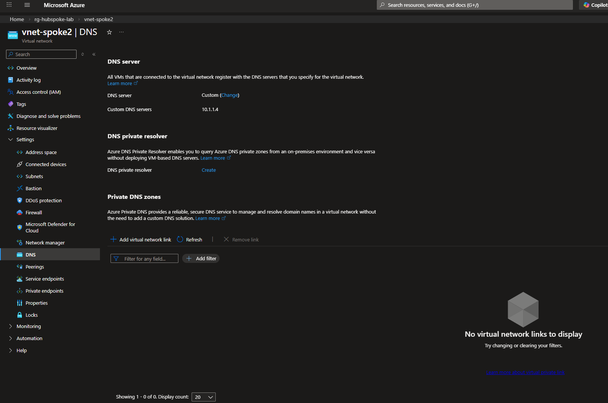
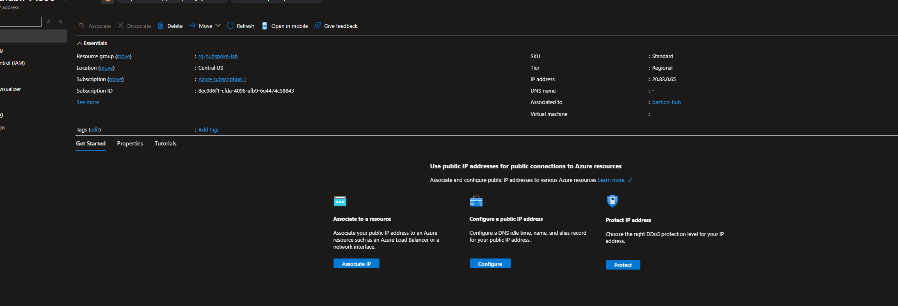

# Networking

**Overview**

Three virtual networks form the foundation of this lab. The hub VNet acts as the central transit point while the two spoke VNets host the workloads. All VNets are connected via VNet peering with traffic between spokes enforced through the hub firewall.

**Hub VNet**

The hub VNet (10.0.0.0/16) houses all shared infrastructure including the Azure Firewall and Azure Bastion. It contains two dedicated subnets — one for each service.

**Spoke VNets**

vnet-spoke1 (10.1.0.0/16) hosts DC01 and serves as the identity and domain services network. vnet-spoke2 (10.2.0.0/16) hosts WIN11-CLIENT01 and represents the client workload network.

**VNet Peering**

Both spoke VNets are peered to the hub. Allow forwarded traffic is enabled on both peering connections, which is required for traffic to traverse the hub firewall between spokes. Spoke1 and Spoke2 are not directly peered to each other — all inter-spoke traffic must pass through the hub.

**DNS Configuration**

vnet-spoke2 is configured with a custom DNS server pointing to DC01 at 10.1.1.4. This ensures WIN11-CLIENT01 resolves domain queries against the Active Directory DNS server rather than Azure's default resolver, which has no knowledge of the domain.

**Azure Bastion**

Azure Bastion is deployed in the hub VNet and provides secure browser-based RDP and SSH access to virtual machines in both spokes. No public IP addresses are assigned to any workload — all VM access is routed exclusively through Bastion.

