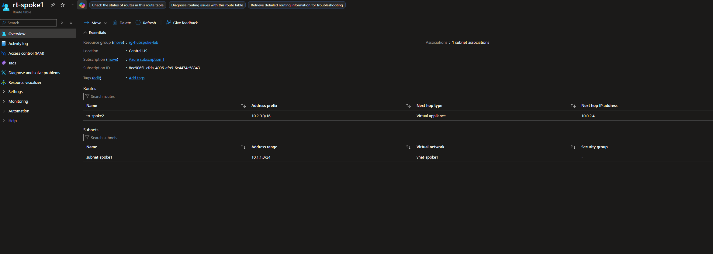
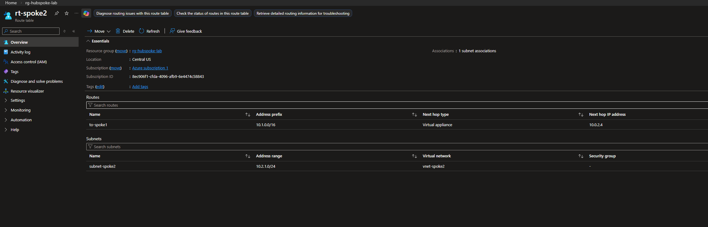
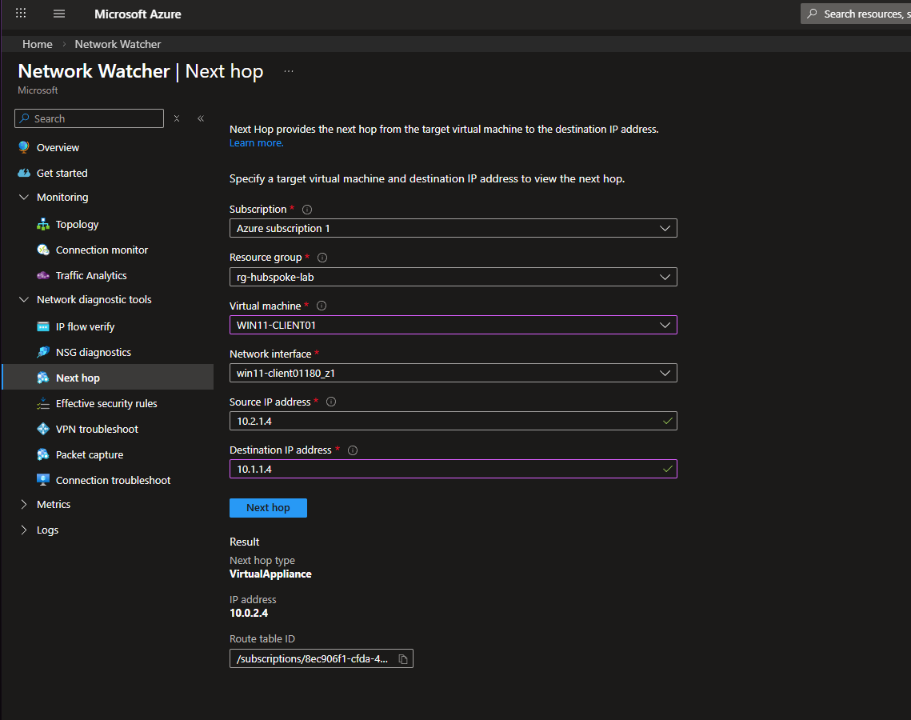

# Routing

**Overview** 

This section covers the User Defined Routes (UDRs) configured to enforce traffic through the Azure Firewall in the hub VNet. Two route tables are deployed in the environment — one per spoke subnet.

**Spoke 1 Route Table**

**Spoke 2 Route Table**

**Verification**

Routing was verified using Azure Network Watcher — Next Hop. With WIN11-CLIENT01 as the source and DC01 (10.1.1.4) as the destination, the result confirmed:

This confirms all inter-spoke traffic is forced through the Azure Firewall before reaching its destination. For further confirmation, I utilized firewall traffic logs to show all traffic between spoke 1, spoke 2, and the firewall. Firewall logs are shown inside of the [Firewall](Firewall) folder of this repository. 
